# FAST-LIVO2

## FAST-LIVO2: Fast, Direct LiDAR-Inertial-Visual Odometry

### 1. Related video

Our accompanying video is now available on [**YouTube**](https://www.youtube.com/watch?v=aSAwVqR22mo&ab_channel=MARSLABHKU).

### 2. Related paper

Related paper will be available on **arxiv** soon.  

### 3. Codes & Datasets & Application

Our paper is currently undergoing peer review. The code, dataset, and application will be released once the paper is accepted.

### 4. Preview

This section showcases representative results of FAST-LIVO2 with high-resolution screenshots, allowing for easier observation of details.

#### 4.1 Online point cloud mapping results (Partial)

All sequences in FAST-LIVO2 private dataset are captured using low-cost Livox Avia LiDAR + pinhole camera.

   
    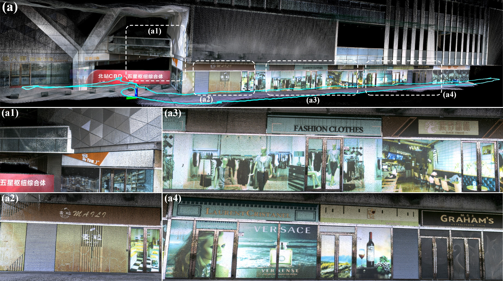 
    
"CBD Building 03" sequence (severe LiDAR and camera degeneration)

   
    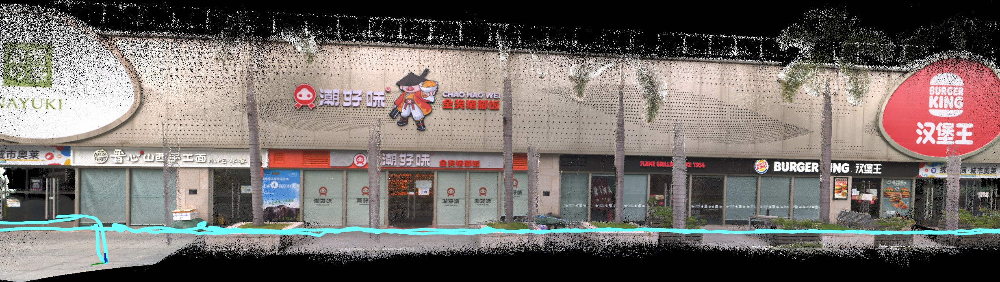 
    
"Retail Street" sequence

   
    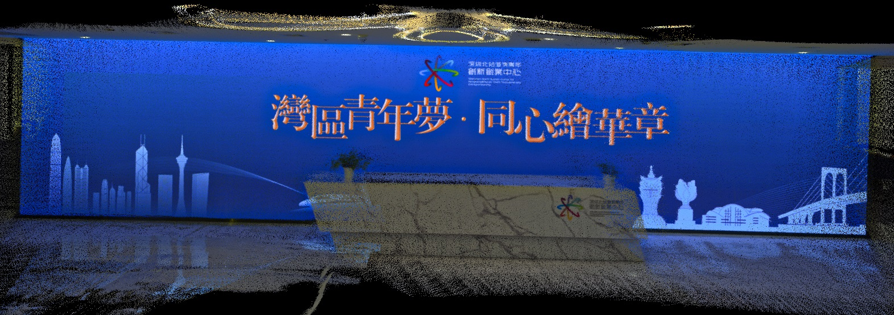 
    
"Bright Screen Wall" sequence (severe LiDAR degeneration)

    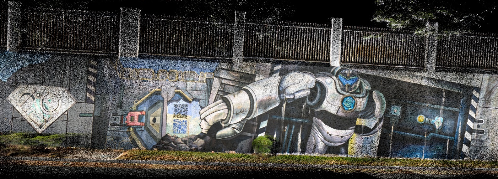
    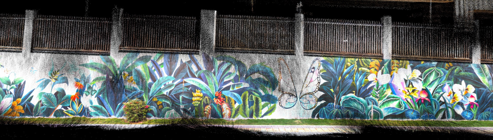
    
"HIT Graffiti Wall" sequence (severe LiDAR degeneration)

   
    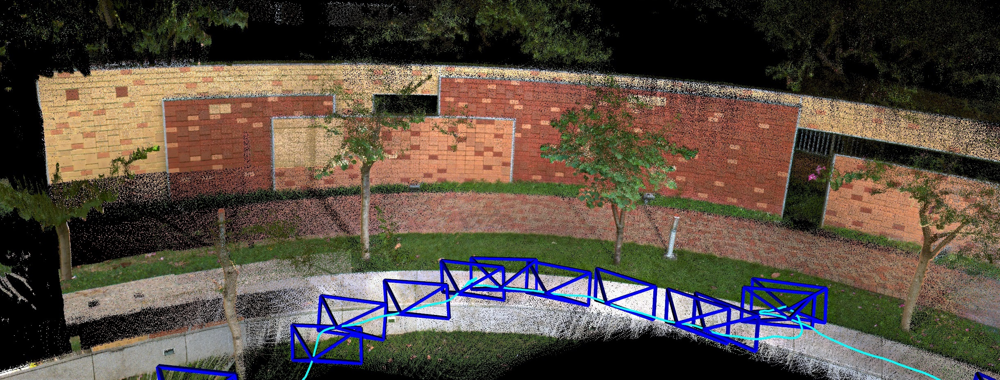 
    
"HKU Centennial Garden" sequence

   
    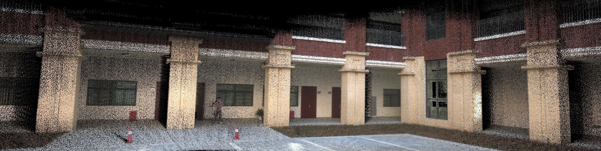 
    
"SYSU 01" sequence

   
    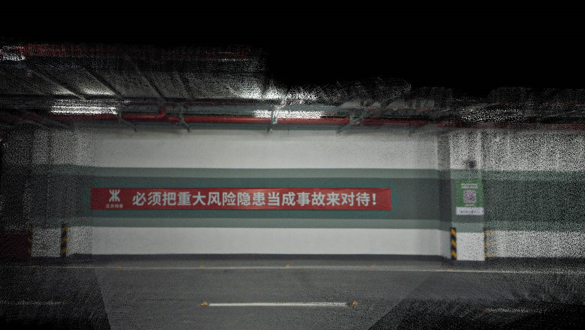   
    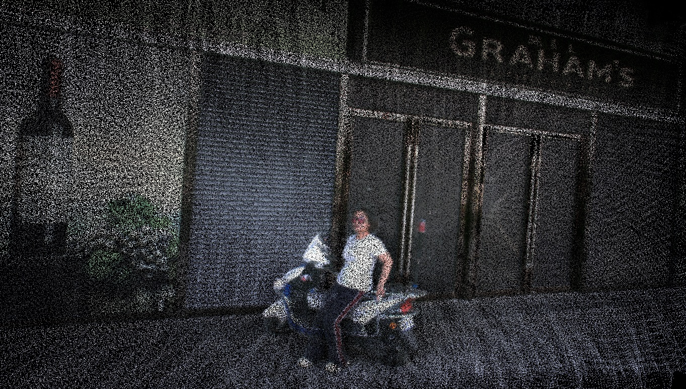 
     
Left: "Banner Wall" sequence (severe LiDAR degeneration), Right: "CBD Building 02" sequence (severe LiDAR degeneration)

        
            
      
    
Left: "HKU Landmark" sequence, Right: "HKUST Red Sculpture" sequence

    
    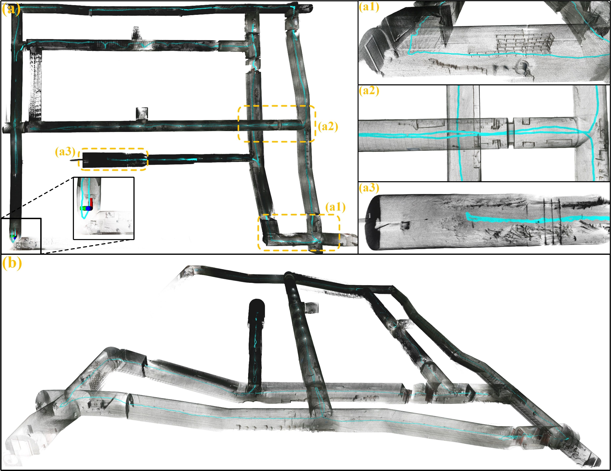  
    
"Mining Tunnel" sequence (severe LiDAR and camera degeneration)

   
    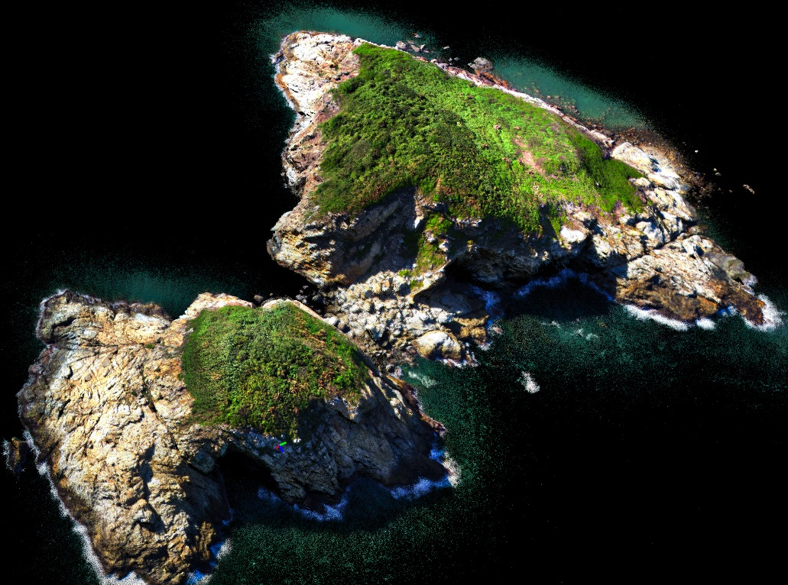   
    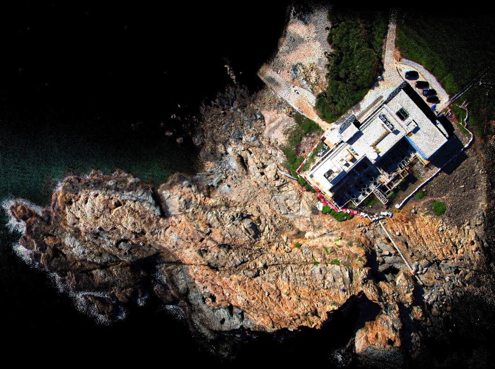 
     
"HKisland01" sequence

    
    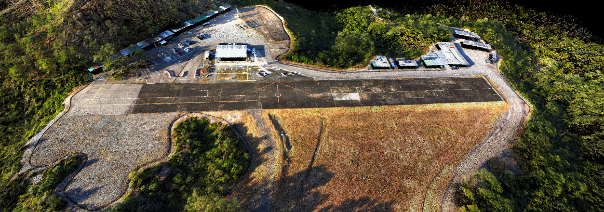
    
"HKairport01" Sequence (LiDAR degeneration)

#### 4.2 Mesh and texture reconstruction based on our dense colored point clouds

   
    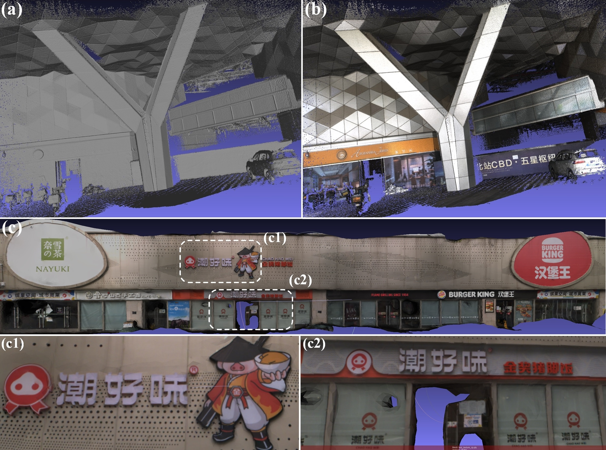 
    
(a) and (b) are the mesh and texture mapping of “CBD
 Building 01”, respectively. (c) is the texture mapping of “Retail
 Street”, with (c1) and (c2) showing local details.

#### 4.3 Gaussian Splatting based on our dense colored point clouds

   
    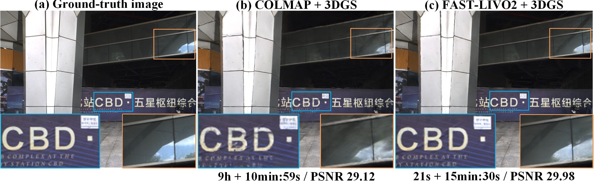 
    
Comparison of ground-truth image, COLMAP+3DGS, and FAST-LIVO2+3DGS in terms of render details, computational time (time for generating point clouds and estimating poses + training time), and PSNR for a random frame in “CBD
 Building 01”.

