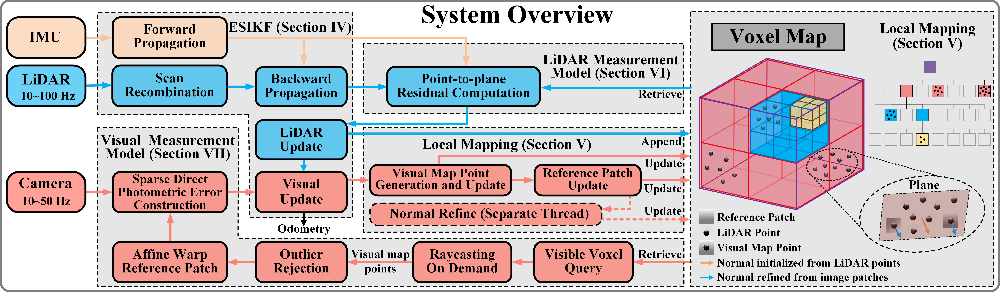

# FAST-LIVO2

## FAST-LIVO2: Fast, Direct LiDAR-Inertial-Visual Odometry

### 📢 News

- 🔓 **2025-01-23**: Code released!  
- 🎉 **2024-10-01**: Accepted by **T-RO '24**!  
- 🚀 **2024-07-02**: Conditionally accepted.

### 📬 Contact

If you have any questions, please feel free to contact: Chunran Zheng [zhengcr@connect.hku.hk](mailto:zhengcr@connect.hku.hk).

## 1. Introduction

FAST-LIVO2 is an efficient and accurate LiDAR-inertial-visual fusion localization and mapping system, demonstrating significant potential for real-time 3D reconstruction and onboard robotic localization in severely degraded environments.

<div align="center">
    
</div>

### 1.1 Related video

Our accompanying video is now available on [**Bilibili**](https://www.bilibili.com/video/BV1Ezxge7EEi) and [**YouTube**](https://youtu.be/6dF2DzgbtlY).

### 1.2 Related paper

[FAST-LIVO2: Fast, Direct LiDAR-Inertial-Visual Odometry](https://arxiv.org/pdf/2408.14035)  

[FAST-LIVO: Fast and Tightly-coupled Sparse-Direct LiDAR-Inertial-Visual Odometry](https://arxiv.org/pdf/2203.00893)

### 1.3 Our hard-synchronized equipment

We open-source our handheld device, including CAD files, synchronization scheme, STM32 source code, wiring instructions, and sensor ROS driver. Access these resources at this repository: [**LIV_handhold**](https://github.com/xuankuzcr/LIV_handhold).

### 1.4 Our associate dataset: FAST-LIVO2-Dataset
Our associate dataset [**FAST-LIVO2-Dataset**](https://connecthkuhk-my.sharepoint.com/:f:/g/personal/zhengcr_connect_hku_hk/ErdFNQtjMxZOorYKDTtK4ugBkogXfq1OfDm90GECouuIQA?e=KngY9Z) used for evaluation is also available online.

### 1.5 Our LiDAR-camera calibration method
The [**FAST-Calib**](https://github.com/hku-mars/FAST-Calib) toolkit is recommended. Its output extrinsic parameters can be directly filled into the YAML file. 

## 2. Prerequisited

### 2.1 Ubuntu and ROS

Ubuntu 18.04~20.04.  [ROS Installation](http://wiki.ros.org/ROS/Installation).

### 2.2 PCL && Eigen && OpenCV

PCL>=1.8, Follow [PCL Installation](https://pointclouds.org/). 

Eigen>=3.3.4, Follow [Eigen Installation](https://eigen.tuxfamily.org/index.php?title=Main_Page).

OpenCV>=4.2, Follow [Opencv Installation](http://opencv.org/).

### 2.3 Sophus

Sophus Installation for the non-templated/double-only version.

```bash
git clone https://github.com/strasdat/Sophus.git
cd Sophus
git checkout a621ff
mkdir build && cd build && cmake ..
make
sudo make install
```

### 2.4 Vikit

Vikit contains camera models, some math and interpolation functions that we need. Vikit is a catkin project, therefore, download it into your catkin workspace source folder.

```bash
# Different from the one used in fast-livo1
cd catkin_ws/src
git clone https://github.com/xuankuzcr/rpg_vikit.git 
```

## 3. Build

Clone the repository and catkin_make:

```
cd ~/catkin_ws/src
git clone https://github.com/hku-mars/FAST-LIVO2
cd ../
catkin_make
source ~/catkin_ws/devel/setup.bash
```

## 4. Run our examples

Download our collected rosbag files via OneDrive ([**FAST-LIVO2-Dataset**](https://connecthkuhk-my.sharepoint.com/:f:/g/personal/zhengcr_connect_hku_hk/ErdFNQtjMxZOorYKDTtK4ugBkogXfq1OfDm90GECouuIQA?e=KngY9Z)). 

```
roslaunch fast_livo mapping_avia.launch
rosbag play YOUR_DOWNLOADED.bag
```


## 5. License

The source code of this package is released under the [**GPLv2**](http://www.gnu.org/licenses/) license. For commercial use, please contact me at <zhengcr@connect.hku.hk> and Prof. Fu Zhang at <fuzhang@hku.hk> to discuss an alternative license.